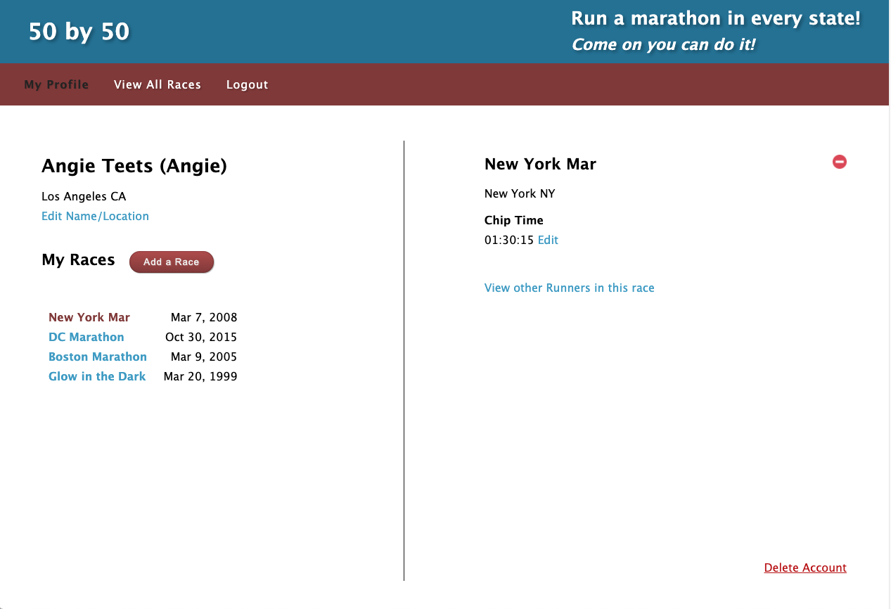

# 50 by 50 
### A social goal setting app for runners
 
For the runners who like to travel, this app will help you keep track of each state you've run races in. You can also  write to fellow runners and compare your chip times.
   

## Screenshots

## Technologies
This app was built with the following technologies:
- Node.js
- Express.js
- Mongo
- Javascript
- CSS
- HTML

### Links
Links to come
- [Trello board](https://trello.com/b/rb1WX2a8/50by50)
- Deployed app

## Icebox
- A better search function when adding new times to existing races
- Acheivement badges and better visualization of race completion through the states
